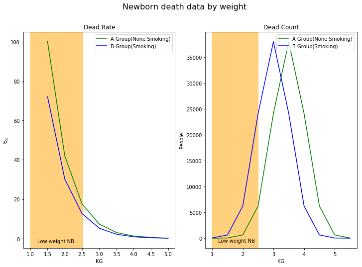

## Simpson's Paradox
**在某个条件下的两组数据，分别讨论都会满足某种性质，可使一旦合并考虑，却可能导致相反的结论。**

A组为母亲`无吸烟行为`的数据，B组为母亲`有吸烟行为`的数据。如果不计算人数并且去掉未能统计的数值，那么简单的对比下来高风险的B组的死亡率要比A组低从而得出貌似吸引行为的风险更低的直观感觉。

**但是实际上，吸烟的母亲产下的新生儿体重偏低的概率高 --> 体重偏低的新生儿死亡率高 --> 吸烟的母亲产下的新生儿死亡概率高。**


出生时体重(g) | A组死亡人数 | 新生儿死亡率(千分之)|B组死亡人数 | 新生儿死亡率(千分之)
---|---|---|---|---
1000 | 0 | null | 40 | 175.0 
1500 | 40 | 100.0 | 630 | 72.0 
2000 | 630 | 42.0 | 6230 | 30.2 
2500 | 6230 | 17.6 | 24100 | 12.7 
3000 | 24100 | 7.4 | 38000 | 5.3
3500 | 38000 | 3.1 | 24100 | 2.2 
4000 | 24100 | 1 |3 | 6230 | 0.9 
4500 | 6230 | 0.6 | 630 | 0.4 
5000 | 630 | 0.2 | 40 | 0.2 
5500 | 40 | 0.1 | 0 | null 
合计 | 100000 | 4.7 | 100000 | 8.1

参考标准：
新生儿体重是衡量小儿生长发育的重要标志，新生儿出生时平均体重为3000克。 正常范围为2500～4000克。

```python
import random
from matplotlib import pyplot as plt

%matplotlib inline

data_set = [
# weight, a gourp dead count, a group dead rate, b gourp dead count, b group dead rate
    [1000, 0, None, 40, 175.0],
    [1500, 40, 100.0, 630, 72.0],
    [2000, 630, 42.0, 6230, 30.2],
    [2500, 6230, 17.6, 24100, 12.7],
    [3000, 24100, 7.4, 38000, 5.3],
    [3500, 38000, 3.1, 24100, 2.2],
    [4000, 24100, 1.3, 6230, 0.9],
    [4500, 6230, 0.6, 630, 0.4],
    [5000, 630, 0.2, 40, 0.2],
    [5500, 40, 0.1, 0, None],
]
# Total 100000, 4.7, 100000, 8.1

weights = [x[0]/1000 for x in data_set]
ag_dead_count = [x[1] for x in data_set]
ag_dead_rate = [x[2] for x in data_set]
bg_dead_count = [x[3] for x in data_set]
bg_dead_rate = [x[4] for x in data_set]

fig, axarr = plt.subplots(1, 2, figsize=(12, 8))
fig.suptitle('Newborn death data by weight', fontsize=16)
# Dead rate chart
# Remove null data points
axarr[0].set_title('Dead Rate')
axarr[0].set_xlabel('KG')
axarr[0].set_ylabel('‰')
axarr[0].plot(weights[1:-1], ag_dead_rate[1:-1], c='red', label='A Group(None Smoking)')
axarr[0].plot(weights[1:-1], bg_dead_rate[1:-1], c='Blue', label='B Group(Smoking)')
axarr[0].axvspan(1,2.5, color="orange", alpha=0.5)
axarr[0].legend()
axarr[0].text(1.2, 0, 'Low weight NB', verticalalignment='top')

axarr[1].set_title('Dead Count')
axarr[1].set_xlabel('KG')
axarr[1].set_ylabel('People')
axarr[1].plot([w for w in weights], ag_dead_count, c='red', label='A Group(None Smoking)')
axarr[1].plot([w for w in weights], bg_dead_count, c='Blue', label='B Group(Smoking)')
axarr[1].axvspan(1,2.5, color="orange", alpha=0.5)
axarr[1].legend()
axarr[1].text(1.2, 0, 'Low weight NB', verticalalignment='top')

fig.show()
```
下图左边取出AB两组对应不存在的数据后，可以看到高风险B组比A组低。但是加入人数计算后，在低体重新生儿区间，高风险B组的死亡率比A组高。


