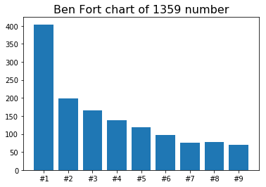

物理学家弗兰克.本福特在其研究发现，人口统计数字、计算机内的文件大小数字，如161974、14739、1980、1476820...首位数字是“1”的情形非常多，而2，3...9这些数字排在数据首位的比例是在不断降低的，数字越大出现的频率越低。

但是如果从随机数里面排列之后还是无法得到很好的下阶梯图像：如下

```python
# Ben Fort Chart
import random
from matplotlib import pyplot as plt
%matplotlib inline

max_num = random.randint(1, 10000)
min_num = random.randint(1, max_num)
sec_max_num = random.randint(min_num, max_num)
int_list = random.sample(range(1, max_num), sec_max_num)

result = dict()

for i in int_list:
    iStr = str(i)
    result.setdefault(iStr[0], []).append(iStr)

data = []
series = []
for i in range(1, 10):
    series.append(f'#{i}')
    data.append(len(result.get(str(i), [])))

plt.title(f'Ben Fort chart of {len(int_list)} number', fontsize=16)
plt.bar(series, data)
plt.show()
```




说明本福特定律也不是在所有情况下都适用。

这里需要寻找一个合适的例子，股价排序？